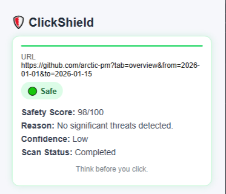
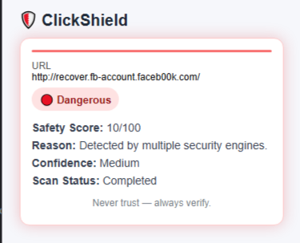
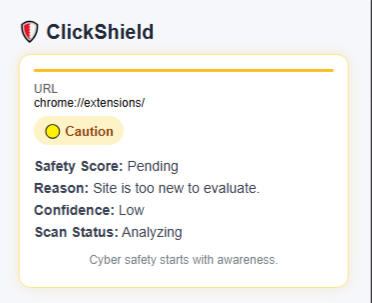

# ClickShield — Real-Time Website Risk Scanner for Chrome

ClickShield is a Chrome extension that analyzes websites as you browse and provides security insights based on VirusTotal results and heuristic scoring.

---

## Overview

ClickShield checks URLs in real time and provides:
- A safety verdict (Safe, Caution, Dangerous, Unknown)
- A confidence indicator
- A short reason explaining the rating
- Optional reporting tools

All checks happen only on the current page you are viewing.  
No browsing history is stored or transferred beyond the VirusTotal API request.

---

## UI Preview

### Safe Site

### Suspicious Site

### Dangerous Site

### Too New / Unknown Site

---

## Features

- Real-time URL scanning
- VirusTotal API integration
- Risk scoring and color-coded verdicts
- Explanable results (multiple engines, suspicious, clean)
- Confidence estimation
- Reporting shortcut (optional)
- Polished and modern UI

---

## How to Install (Developer Mode)

1. Download or clone this repository.
2. Open Chrome and go to:
3. 3. Enable **Developer Mode**
4. Click **Load Unpacked**
5. Select the ClickShield folder

The extension will now appear in your browser toolbar.

---

## Roadmap

Planned improvements:
- Local blacklist storage
- Block mode for dangerous sites
- Settings page
- Brand impersonation heuristics
- Exportable reports

---

## Contributing

Issues and pull requests welcome.

---

## License

Released under the MIT License.

